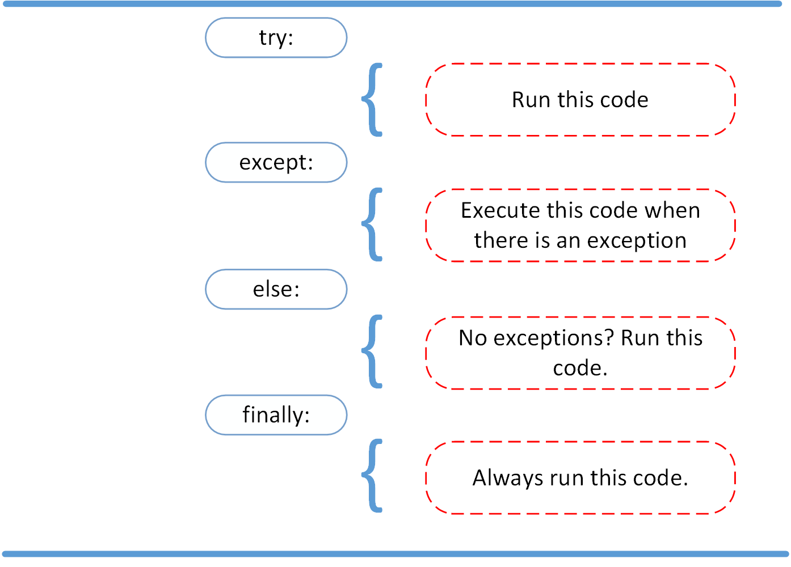

# FileIO & Exceptions

## Reading and Writing Files in Python

> One of the most common tasks that you can do with Python is reading and writing files.

before we start what is a file?A file is a contiguous set of bytes used to store data

it consist of three main parts:

**Header:** metadata about the contents of the file (file name, size, type, and so on)

**Data:** contents of the file as written by the creator or editor

**End of file (EOF):** special character that indicates the end of the file

when you call a file you have to call it by its path,nme and extintion usinf either it's absolut path or the relative path

Now how you open and use it in python

you can use the code

file = `open('name_of_the_file.extintion')`

then you will have to use the try-finally method

`try:`
    `# Further file processing goes here`
`finally:`
    `reader.close()`

and dont forget to close the file

The second way to close a file is to use the with statement:

`with open('name_of_the_file.extintion') as reader:`
    `# Further file processing goes here`

The with statement automatically takes care of closing the file once it leaves the with block, even in cases of error.

there is some modes of openning a file using the `with` method using the following charecters

'r' Open the file in reading mode which is the default mode

'w' Open the file in writing mode, truncating (overwriting) the file first

and you can add the 'b' after any of those to open it in binary mode

you add those charecters as an integers in the with method as followed

`with open('name_of_the_file.extintion', 'rb') as reader:`
    `# Further file processing goes here`

## Reading and Writing Opened Files

### Reading Files

These are the methods used in reading files

| **Method** | **What It Does** |
|------------|-------------------|
| *`.read(size=-1)`* |reads from the file based on the number of size bytes, if the value less than 0 or not entered it will read the whole file|
| *`.readline(size=-1)`* |same as the above but for the lines|
| *`.readlines()`* |reads the rest of the lines and return them as a list|

example:

`with open('name_of_the_file.extintion', 'r') as reader:`
    `print(reader.read())`

The result will be the containings of the file...

If you want to Iterating Over Each Line in the File you could follow the example below:

This will Read and print the entire file line by line

`with open('name_of_the_file.extintion', 'r') as reader:`
     `line = reader.readline()`
     `while line != '':  # The EOF char is an empty string`
         `print(line, end='')`
         `line = reader.readline()`

OR:

`with open('dog_breeds.txt', 'r') as reader:`
    `for line in reader.readlines():`
        `print(line, end='')`

### Writing Files

These are the methods used in writing files

| **Method** | **What It Does** |
|------------|-------------------|
| *`.write(string)`* |This writes the string to the file.|
| *`.writelines(seq)`* |This writes the sequence to the file. No line endings are appended to each sequence item. It’s up to you|

Lets jump into an example:

`with open('dog_breeds.txt', 'r') as reader:`
    `dog_breeds = reader.readlines()`

`with open('dog_breeds_reversed.txt', 'w') as writer:`
    `for breed in reversed(dog_breeds):`
        `writer.write(breed)`

This Writes the dog breeds to the file in reversed order

### Working With Bytes

add the 'b' will make the file return in the Bytes form

and you can use it when working with the not text files such as photo files

the header of the file is 8 bytes broken up like this:

 **Value** | **Interpretation** |
|------------|-------------------|
| *0x89* |A “magic” number to indicate that this is the start of a PNG|
| *0x50 0x4E 0x47* |PNG in ASCII|
| *0x0D 0x0A* |A DOS style line ending \r\n|
| *0x1A* |A DOS style EOF character|
| *0x0A* |A Unix style line ending \n|

Here is an example:

`with open('jack_russell.png', 'rb') as byte_reader:`
     `print(byte_reader.read(1))`
     `print(byte_reader.read(3))`
     `print(byte_reader.read(2))`
     `print(byte_reader.read(1))`
     `print(byte_reader.read(1))`

Example result:

b'\x89'
b'PNG'
b'\r\n'
b'\x1a'
b'\n'

> **Note:** To re-iterate, __file__ returns the path relative to where the initial Python script was called. If you need the full system path, you can use os.getcwd() to get the current working directory of your executing code.

###### Writing In The End Of A File

want to append to a file or start writing at the end of an already populated file. This is easily done by using the `'a'` character for the mode argument:

`with open('name_of_the_file.extintion', 'a') as a_writer:`
    `a_writer.write('\nBeagle')`

###### Working With Two Files at the Same Time

Do as the example:

`d_path = 'dog_breeds.txt'`
`d_r_path = 'dog_breeds_reversed.txt'`
`with open(d_path, 'r') as reader, open(d_r_path, 'w') as writer:`
    `dog_breeds = reader.readlines()`
    `writer.writelines(reversed(dog_breeds))`

## Python Exceptions

### Exceptions versus Syntax Errors

When does Errors happens?

Syntax errors occur when the parser detects an incorrect statement
exception errors occur whenever syntactically correct Python code results in an error.

Python details what type of exception error was encountered from the various built-in exceptions

### Raising an Exception

> We can use raise to throw an exception if a condition occurs. The statement can be complemented with a custom exception.

Example:

`x = 10`
`if x > 5:`
    `raise Exception('x should not exceed 5. The value of x was: {}'.format(x))`

The result:

`Traceback (most recent call last):`
  `File "<input>", line 4, in <module>`
`Exception: x should not exceed 5. The value of x was: 10`

### The AssertionError Exception

We assert that a certain condition is met If the condition turns out to be False, you can have make program send an AssertionError exception.

Example:

`import sys`
`assert ('linux' in sys.platform), "This code runs on Linux only."`

Result If you are running this code on other than linux OS:

`Traceback (most recent call last):`
  `File "<input>", line 2, in <module>`
`AssertionError: This code runs on Linux only.`

### The try and except Block

The `try` and `except` block in Python is used to catch and handle exceptions.

try: will try to run a code

While except will run if try faced an exception

Example:

`try:`
    `linux_interaction()`
`except:`
    `pass`

The linux_interaction() can only run on a Linux system so in this example if you are running it on other the linux it will pass instead of throwing the error

The following code is an example where you capture the AssertionError and output that message to screen:

`try:`
    `linux_interaction()`
`except AssertionError as error:`
    `print(error)`
    `print('The linux_interaction() function was not executed')`

You can change the `AssertionError` as the expected error message to capture other kinds of errors

Here a more complex example:

`try:`
    `linux_interaction()`
    `with open('file.log') as file:`
        `read_data = file.read()`
`except FileNotFoundError as fnf_error:`
    `print(fnf_error)`
`except AssertionError as error:`
    `print(error)`
    `print('Linux linux_interaction() function was not executed')`

### The else Clause

In case there is no exceptions it will run the code in the else block

example:

`try:`
    `linux_interaction()`
`except AssertionError as error:`
    `print(error)`
`else:`
    `print('Executing the else clause.')`

You can use the else to write a nested try and except

### Cleaning Up After Using finally

You can write the code that you want it always to run in the finally code block

Example:

`try:`
    `linux_interaction()`
`except AssertionError as error:`
    `print(error)`
`else:`
    `try:`
        `with open('file.log') as file:`
            `read_data = file.read()`
    `except FileNotFoundError as fnf_error:`
        `print(fnf_error)`
`finally:`
    `print('Cleaning up, irrespective of any exceptions.')`

The result will be as the following:

`Function can only run on Linux systems.`
`Cleaning up, irrespective of any exceptions.`

## The Whole structure Of It:

