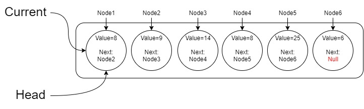

# Linked Lists

## What are the linked lists

**Linked List:**A data structure that contains nodes that links/points to the next node in the list.

Linked List Types:

| **Singly** | **Doubly** |
|------------|-------------------|
| There is only one Node link |There is two Node links|

The current shows refere to the current node you are at

The Head refares to the first node in the list

and Next refares to the next node from the current one

When we want to loop in the list we use the next and the current,
Using the while loop we can iterate over the list till the next value is equal Null

## Adding Nodes

If you want to add a node to a list before the Head node you can add it by:

Make a function calls the property `newNode.next` and because the newNode does not exist in the list yet the value of `newNode.next` will be null

so set it to node1 this will create it before the node1

change the `Head` value to be as the `newNode`

then the `current` to the `head`

Now you have added a node before the head

Easy Right?

But what if we want to add between 2 nodes:

same as the one above but you have to cahnge the next value for the node before the newNode added to the new Node

Ex: if you wan to add the not 10 between the node 4 and 5 , after following the steps you have to make the     `node4.next = node 10`

And Thats it