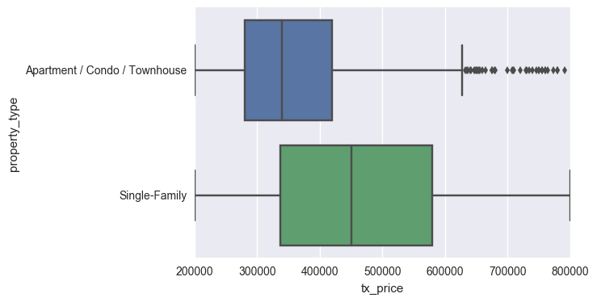

# Machine Learning Intro

## 1:- Bird's Eye View

> Machine Learning ≠ Algorithms

Machine learning is not about algorithms.

When you open a textbook or a university syllabus, you'll often be greeted by a grocery list of algorithms.

This has fueled the misconception that machine learning is about mastering dozens of algorithms. However, it's much more than that...

***Machine learning is a comprehensive approach to solving problems...***

### What makes machine learning so special?

Machine learning is the practice of teaching computers how to learn patterns from data, often for making decisions or predictions.

by get into the experience and learn from it by testing and failing

### Key Terminology

| **Term** | **Meaning** |
|------------|-------------------|
|Model|a set of patterns learned from data|
|Algorithm|a specific ML process used to train a model|
|Training data|the dataset from which the algorithm learns the model|
|Test data|a new dataset for reliably evaluating model performance|
|Features|Variables (columns) in the dataset used to train the model|
|Target variable|A specific variable you're trying to predict|
|Observations|Data points (rows) in the dataset|

### Machine Learning Tasks

- A task is a specific objective for your algorithms.
- Algorithms can be swapped in and out, as long as you pick the right task.
- you should always try multiple algorithms because you most likely won't know which one will perform best for your dataset.

#### Supervised Learning

Supervised learning includes tasks for "labeled" data (i.e. you have a target variable).

- In practice, it's often used as an advanced form of predictive modeling.
- Each observation must be labeled with a "correct answer."
- Only then can you build a predictive model because you must tell the algorithm what's "correct" while training it (hence, "supervising" it).
- **Regression** is the task for modeling continuous target variables.
- **Classification** is the task for modeling categorical (a.k.a. "class") target variables.

#### Unsupervised Learning

Unsupervised learning includes tasks for "unlabeled" data (i.e. you do not have a target variable).

- In practice, it's often used either as a form of automated data analysis or automated signal extraction.
- Unlabeled data has no predetermined "correct answer."
- You'll allow the algorithm to directly learn patterns from the data (without "supervision").
- **Clustering** is the most common unsupervised learning task, and it's for finding groups within your data.

### The 3 Elements of Great Machine Learning

- 1: A skilled chef (human guidance)
  - As you'll see, you'll need to make dozens of decisions along the way.
  - In fact, the very first major decision is how to road-map your project for guaranteed success.

- 2: Fresh ingredients (clean, relevant data)
  - Garbage In = Garbage Out, no matter which algorithms you use.
  - Professional data scientists spend most their time understanding the data, cleaning it, and engineering new features.

- #3: Don't overcook it (avoid overfitting)
  - An overfit model within a hedge fund can cost millions of dollars in losses.
  - An overfit model within a hospital can costs thousands of lives.
  - For most applications, the stakes won't be quite that high, but overfitting is still the single largest mistake you must avoid.

---

## Exploratory Analysis

### Why explore your dataset upfront?

The purpose of exploratory analysis is to "get to know" the dataset. Doing so upfront will make the rest of the project much smoother, in 3 main ways:

1. You’ll gain valuable hints for Data Cleaning (which can make or break your models).
2. You’ll think of ideas for Feature Engineering (which can take your models from good to great).
3. You’ll get a "feel" for the dataset, which will help you communicate results and deliver greater impact.

### Start with Basics

First, you'll want to answer a set of basic questions about the dataset:

- How many observations do I have?
- How many features?
- What are the data types of my features? Are they numeric? Categorical?
- Do I have a target variable?

### Plot Numerical Distributions

Often, a quick and dirty grid of histograms is enough to understand the distributions.

Here are a few things to look out for:

- Distributions that are unexpected
- Potential outliers that don't make sense
- Features that should be binary (i.e. "wannabe indicator variables")
- Boundaries that don't make sense
- Potential measurement errors

At this point, you should start making notes about potential fixes you'd like to make.

### Plot Categorical Distributions

Categorical features cannot be visualized through histograms. Instead, you can use bar plots.

In particular, you'll want to look out for sparse classes, which are classes that have a very small number of observations

**class** is simply a unique value for a categorical feature

### Plot Segmentations

Segmentations are powerful ways to observe the relationship between categorical features and numeric features.

**Box plots** allow you to do so.

- The median transaction price (middle vertical bar in the box) for Single-Family homes was much higher than that for Apartments / Condos / Townhomes.
- The min and max transaction prices are comparable between the two classes.
- In fact, the round-number min ($200k) and max ($800k) suggest possible data truncation...
...which is very important to remember when assessing the generalizability of your models later!

### Study Correlations

correlations allow you to look at the relationships between numeric features and other numeric features.

- Positive correlation means that as one feature increases, the other increases. E.g. a child’s age and her height.
- Negative correlation means that as one feature increases, the other decreases. E.g. hours spent studying and number of parties attended.
- Correlations near -1 or 1 indicate a strong relationship.
- Those closer to 0 indicate a weak relationship.
- 0 indicates no relationship.

---

## Data Cleaning

### Better Data > Fancier Algorithms

Better data beats fancier algorithms.

In other words...
> ***garbage in gets you garbage out.***
*Even if you forget everything else from this course, please remember this point.*

In fact, if you have a properly cleaned dataset, even simple algorithms can learn impressive insights from the data!

### Remove Unwanted observations

- Duplicate observations
  - Combine datasets from multiple places
  - Scrape data
  - Receive data from clients/other departments

- Irrelevant observations
Irrelevant observations are those that don’t actually fit the specific problem that you’re trying to solve.

Checking for irrelevant observations before engineering features can save you many headaches down the road.

### Fix Structural Errors

Structural errors are those that arise during measurement, data transfer, or other types of **"poor housekeeping."**

For instance, you can check for typos or inconsistent capitalization

Finally, check for mislabeled classes, i.e. separate classes that should really be the same.
EX

- If ’N/A’ and ’Not Applicable’ appear as two separate classes, you should combine them.
- ’IT’ and ’information_technology’ should be a single class.

### Filter Unwanted Outliers

Outliers can cause problems with certain types of models

In general, if you have a legitimate reason to remove an outlier, it will help your model’s performance.

However, outliers are innocent until proven guilty. You should never remove an outlier just because it’s a "big number." That big number could be very informative for your model.

### Handle Missing Data

Missing data is a deceptively tricky issue in applied machine learning.

the 2 most commonly recommended ways of dealing with missing data actually suck.They are:

- **Dropping** observations that have missing values
- **Imputing** the missing values based on other observations

The fact that the value was missing may be informative in itself.
Plus, in the real world, you often need to make predictions on new data even if some of the features are missing!

In short, you should always tell your algorithm that a value was missing because missingness is informative.

So how can you do so?

- Missing categorical data:
The best way to handle missing data for categorical features is to simply label them as ’Missing’!
  - You’re essentially adding a new class for the feature.
  - This tells the algorithm that the value was missing.
  - This also gets around the technical requirement for no missing values.

- Missing numeric data:
For missing numeric data, you should flag and fill the values.
  - Flag the observation with an indicator variable of missingness.
  - Then, fill the original missing value with 0 just to meet the technical requirement of no missing values.

---

## Feature Engineering

### What is Feature Engineering

Feature engineering is about creating new input features from your existing ones.

This is often one of the most valuable tasks a data scientist can do to improve model performance, for 3 big reasons:

1. You can isolate and highlight key information, which helps your algorithms "focus" on what’s important.
2. You can bring in your own domain expertise.
3. Most importantly, once you understand the "vocabulary" of feature engineering, you can bring in other people’s domain expertise!

### Infuse Domain Knowledge

You can often engineer informative features by tapping into your (or others’) expertise about the domain.

Well, if you suspect that prices would be affected, you could create an indicator variable for transactions during that period.​ Indicator variables are binary variables that can be either 0 or 1. They "indicate" if an observation meets a certain condition, and they are very useful for isolating key properties.

### Create Interaction Features

The first of these heuristics is checking to see if you can create any interaction features that make sense. These are combinations of two or more features.

By the way, in some contexts, "interaction terms" must be products between two variables. In our context, interaction features can be products, sums, or differences between two features.

### Combine Sparse Classes

Sparse classes (in categorical features) are those that have very few total observations. They can be problematic for certain machine learning algorithms, causing models to be overfit.

There's no formal rule of how many each class needs.

It also depends on the size of your dataset and the number of other features you have.

### Add Dummy Variables

Most machine learning algorithms cannot directly handle categorical features. Specifically, they cannot handle text values.

Therefore, we need to create dummy variables for our categorical features.

Dummy variables are a set of binary (0 or 1) variables that each represent a single class from a categorical feature.

The information you represent is exactly the same, but this numeric representation allows you to pass the technical requirements for algorithms.

### Remove Unused Features

Unused features are those that don’t make sense to pass into our machine learning algorithms. Examples include:

- ID columns
- Features that wouldn't be available at the time of prediction
- Other text descriptions

After completing Data Cleaning and Feature Engineering, you'll have transformed your raw dataset into an analytical base table (ABT). We call it an "ABT" because it's what you'll be building your models on.

---

## Algorithm Selection

### Why Linear Regression is Flawed

Simple linear regression models fit a "straight line" (technically a hyperplane depending on the number of features, but it's the same idea). In practice, they rarely perform well. We actually recommend skipping them for most machine learning problems.

Their main advantage is that they are easy to interpret and understand. However, our goal is not to study the data and write a research report. Our goal is to build a model that can make accurate predictions.

In this regard, simple linear regression suffers from two major flaws:

1. It's prone to overfit with many input features.
2. It cannot easily express non-linear relationships.

### Regularization in Machine Learning

Let's take an extreme example to illustrate why this happens:

- Let's say you have 100 observations in your training dataset.
- Let's say you also have 100 features.
- If you fit a linear regression model with all of those 100 features, you can perfectly "memorize" the training set.
- Each coefficient would simply memorize one observation. This model would have perfect accuracy on the training data, but perform poorly on unseen data.
- It hasn’t learned the true underlying patterns; it has only memorized the noise in the training data.

### Regularized Regression Algos

**Lasso Regression**
Lasso, or LASSO, stands for Least Absolute Shrinkage and Selection Operator.

- Lasso regression penalizes the absolute size of coefficients.
- Practically, this leads to coefficients that can be exactly 0.
- Thus, Lasso offers automatic feature selection because it can completely remove some features.
- Remember, the "strength" of the penalty should be tuned.
- A stronger penalty leads to more coefficients pushed to zero.

**Ridge Regression**
Ridge stands Really Intense Dangerous Grapefruit Eating (just kidding... it's just ridge).

- Ridge regression penalizes the squared size of coefficients.
- Practically, this leads to smaller coefficients, but it doesn't force them to 0.
- In other words, Ridge offers feature shrinkage.
- Again, the "strength" of the penalty should be tuned.
- A stronger penalty leads to coefficients pushed closer to zero.

**Elastic-Net**
Elastic-Net is a compromise between Lasso and Ridge.

- Elastic-Net penalizes a mix of both absolute and squared size.
- The ratio of the two penalty types should be tuned.
- The overall strength should also be tuned.

### Decision Tree Algos

we’ve just seen 3 algorithms that can protect linear regression from overfitting. But if you remember, linear regression suffers from two main flaws:

1. It's prone to overfit with many input features.
2. It cannot easily express non-linear relationships.

---

## Model Training

### How to Train ML Models

At last, it’s time to build our models!

It might seem like it took us a while to get here, but professional data scientists actually spend the bulk of their time on the steps leading up to this one:

- Exploring the data.
- Cleaning the data.
- Engineering new features.

### Split Dataset

Think of your data as a limited resource.

You can spend some of it to train your model (i.e. feed it to the algorithm).
You can spend some of it to evaluate (test) your model.
But you can’t reuse the same data for both!

Training sets are used to fit and tune your models. Test sets are put aside as "unseen" data to evaluate your models.

You should always split your data before doing anything else.
This is the best way to get reliable estimates of your models’ performance.
After splitting your data, don’t touch your test set until you’re ready to choose your final model!

### What are Hyperparameters

When we talk of tuning models, we specifically mean tuning hyperparameters.

There are two types of parameters in machine learning algorithms.

The key distinction is that model parameters can be learned directly from the training data while hyperparameters cannot.

**Model parameters:**
Model parameters are learned attributes that define individual models.

- e.g. regression coefficients
- e.g. decision tree split locations
- They can be learned directly from the training data

**Hyperparameters:**
Hyperparameters express "higher-level" structural settings for algorithms.

- e.g. strength of the penalty used in regularized regression
- e.g. the number of trees to include in a random forest
- They are decided before fitting the model because they can't be learned from the data

### What is Cross-Validation

Cross-validation is a method for getting a reliable estimate of model performance using only your training data.

There are several ways to cross-validate. The most common one, 10-fold cross-validation, breaks your training data into 10 equal parts (a.k.a. folds), essentially creating 10 miniature train/test splits.

These are the steps for 10-fold cross-validation:

1. Split your data into 10 equal parts, or "folds".
2. Train your model on 9 folds (e.g. the first 9 folds).
3. Evaluate it on the 1 remaining "hold-out" fold.
4. Perform steps (2) and (3) 10 times, each time holding out a different fold.
5. Average the performance across all 10 hold-out folds.

### Select Winning Model

By now, you'll have 1 "best" model for each algorithm that has been tuned through cross-validation. Most importantly, you've only used the training data so far.

Because you've saved your test set as a truly unseen dataset, you can now use it get a reliable estimate of each models' performance.

There are a variety of performance metrics you could choose from. We won't spend too much time on them here, but in general:

For regression tasks, we recommend Mean Squared Error (MSE) or Mean Absolute Error (MAE). (Lower values are better)
For classification tasks, we recommend Area Under ROC Curve (AUROC). (Higher values are better)

The process is very straightforward:

- For each of your models, make predictions on your test set.
- Calculate performance metrics using those predictions and the "ground truth" target variable from the test set.

Finally, use these questions to help you pick the winning model:

- Which model had the best performance on the test set? (performance)
- Does it perform well across various performance metrics? (robustness)
- Did it also have (one of) the best cross-validated scores from the training set? (consistency)
- Does it solve the original business problem? (win condition)
