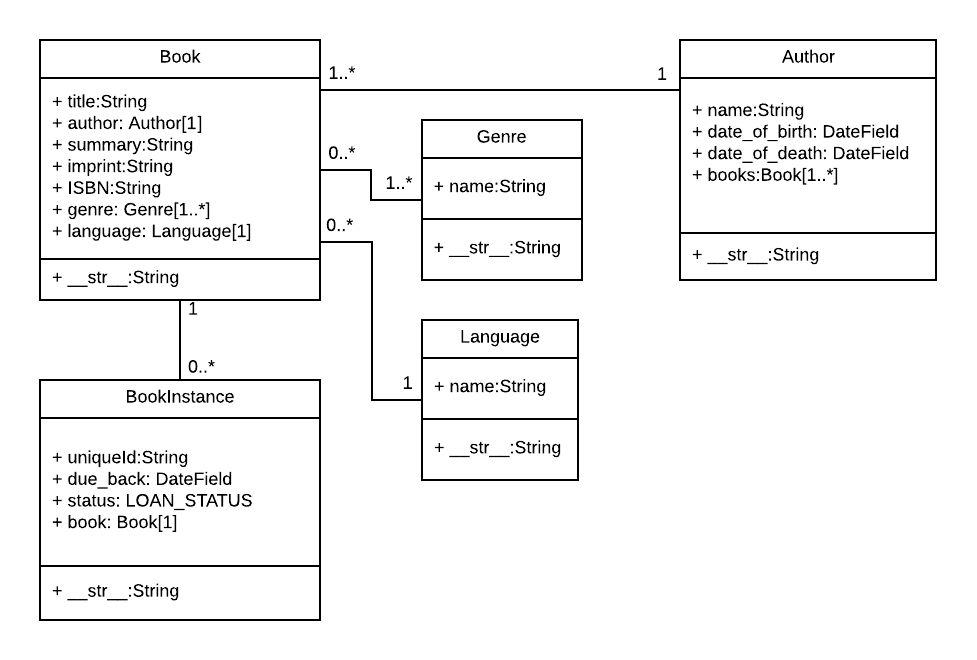

# Django Models

Django web applications access and manage data through Python objects referred to as models. Models define the structure of stored data, including the field types and possibly also their maximum size, default values, selection list options, help text for documentation, label text for forms, etc

## Designing the LocalLibrary models

**what data we need to store and the relationships between the different objects**

We know that we need to store information about books (title, summary, author, written language, category, ISBN) and that we might have multiple copies available (with globally unique id, availability status, etc.).

We might need to store more information about the author than just their name, and there might be multiple authors with the same or similar names. We want to be able to sort information based on book title, author, written language, and category.

> ***When designing your models it makes sense to have separate models for every "object"***

You might also want to use models to represent selection-list options **(e.g. like a drop down list of choices)**, rather than hard coding the choices into the website itself

Once we've decided on our models and field, we need to think about the relationships. Django allows you to define relationships that are one to one **(OneToOneField)**, one to many **(ForeignKey)** and many to many **(ManyToManyField)**.



## Model primer

Models are usually defined in an application's models.py file. They are implemented as subclasses of
`django.db.models.Model`, and can include fields, methods and metadata. The code fragment below shows a "typical" model, named `MyModelName`:

```
from django.db import models

class MyModelName(models.Model):
    """A typical class defining a model, derived from the Model class."""

    # Fields
    my_field_name = models.CharField(max_length=20, help_text='Enter field documentation')
    ...

    # Metadata
    class Meta:
        ordering = ['-my_field_name']

    # Methods
    def get_absolute_url(self):
        """Returns the url to access a particular instance of MyModelName."""
        return reverse('model-detail-view', args=[str(self.id)])

    def __str__(self):
        """String for representing the MyModelName object (in Admin site etc.)."""
        return self.my_field_name
```

### Fields

A model can have an arbitrary number of fields, of any type — each one represents a column of data that we want to store in one of our database tables.

`my_field_name = models.CharField(max_length=20, help_text='Enter field documentation')`

Our above example has a single field called `my_field_name`, of type `models.CharField` — which means that this field will contain strings of alphanumeric characters. The field types are assigned using specific classes, which determine the type of record that is used to store the data in the database

The field types can also take arguments that further specify how the field is stored or can be used. In this case we are giving our field two arguments:

- `max_length=20` — States that the maximum length of a value in this field is 20 characters.
- `help_text='Enter field documentation'` — provides a text label to display to help users know what value to provide when this value is to be entered by a user via an HTML form.

#### Common field arguments

- **help_text:** Provides a text label for HTML forms, as described above.
- **verbose_name:** A human-readable name for the field used in field labels.
- **default:** The default value for the field. This can be a value or a callable object, in which case the object will be called every time a new record is created.
- **null:** If True, Django will store blank values as NULL in the database for fields where this is appropriate. The default is False.
- **blank:** If True, the field is allowed to be blank in your forms. The default is False, which means that Django's form validation will force you to enter a value.
- **choices:** A group of choices for this field. If this is provided, the default corresponding form widget will be a select box with these choices instead of the standard text field.
- **primary_key:** If True, sets the current field as the primary key for the model (A primary key is a special database column designated to uniquely identify all the different table records).

> If no field is specified as the primary key then Django will automatically add a field for this purpose.

#### Common field types

- **CharField** is used to define short-to-mid sized fixed-length strings. You must specify the max_length of the data to be stored.
- **TextField** is used for large arbitrary-length strings. You may specify a max_length for the field.
- **IntegerField** is a field for storing integer (whole number) values, and for validating entered values as integers in forms.
- **DateField** and **DateTimeField** are used for storing/representing dates and date/time information (as Python datetime.date in and datetime.datetime objects, respectively).
- **EmailField** is used to store and validate email addresses.
- **FileField** and ImageField are used to upload files and images respectively (the ImageField adds additional validation that the uploaded file is an image).
- **AutoField** is a special type of IntegerField that automatically increments. A primary key of this type is automatically added to your model if you don’t explicitly specify one.
- **ForeignKey** is used to specify a one-to-many relationship to another database model. The "one" side of the relationship is the model that contains the "key" (models containing a "foreign key" referring to that "key", are on the "many" side of such a relationship).
- **ManyToManyField** is used to specify a many-to-many relationship (e.g. a book can have several genres, and each genre can contain several books). In our library app we will use these very similarly to ForeignKeys, but they can be used in more complicated ways to describe the relationships between groups.

### Metadata

You can declare model-level metadata for your Model by declaring `class Meta`, as shown.

```
class Meta:
    ordering = ['-my_field_name']
```

One of the most useful features of this metadata is to control the default ordering of records returned when you query the model type. You do this by specifying the match order in a list of field names to the ordering attribute, as shown above.

### Methods

A model can also have methods.

**Minimally, in every model you should define the standard Python class method `__str__()` to return a human-readable string for each object.**

This string is used to represent individual records in the administration site (and anywhere else you need to refer to a model instance). Often this will return a title or name field from the model.

```
def __str__(self):
    return self.field_name
```

Another common method to include in Django models is `get_absolute_url()`, which returns a URL for displaying individual model records on the website (if you define this method then Django will automatically add a "View on Site" button to the model's record editing screens in the Admin site).

Ex:

```
def get_absolute_url(self):
    """Returns the url to access a particular instance of the model."""
    return reverse('model-detail-view', args=[str(self.id)])
```

## Model management

Once you've defined your model classes you can use them to create, update, or delete records, and to run queries to get all records or particular subsets of records.

### Creating and modifying records

o create a record you can define an instance of the model and then call `save()`.

```
# Create a new record using the model's constructor.
record = MyModelName(my_field_name="Instance #1")

# Save the object into the database.
record.save()
```

### Searching for records

You can search for records that match certain criteria using the model's `objects` attribute (provided by the base class).

We can get all records for a model as a `QuerySet`, using `objects.all()`. The QuerySet is an iterable object, meaning that it contains a number of objects that we can iterate/loop through.

`all_books = Book.objects.all()`

Django's `filter()` method allows us to filter the returned `QuerySet` to match a specified text or numeric field against particular criteria.

## Defining the LocalLibrary Models

In this section we will start defining the models for the library. Open models.py (in /locallibrary/catalog/).

```
from django.db import models

# Create your models here.
```

### Genre model

Copy the Genre model code shown below and paste it into the bottom of your models.py file. This model is used to store information about the book category

```
class Genre(models.Model):
    """Model representing a book genre."""
    name = models.CharField(max_length=200, help_text='Enter a book genre (e.g. Science Fiction)')

    def __str__(self):
        """String for representing the Model object."""
        return self.name
```

We additionally declare a few new types of field:

- `UUIDField` is used for the `id` field to set it as the `primary_key` for this model. This type of field allocates a globally unique value for each instance (one for every book you can find in the library).
- `DateField` is used for the `due_back` date (at which the book is expected to become available after being borrowed or in maintenance). This value can be blank or null (needed for when the book is available). The model metadata (Class Meta) uses this field to order records when they are returned in a query.
- `status` is a `CharField` that defines a choice/selection list. As you can see, we define a tuple containing tuples of key-value pairs and pass it to the choices argument. The value in a key/value pair is a display value that a user can select, while the keys are the values that are actually saved if the option is selected. We've also set a default value of 'm' (maintenance) as books will initially be created unavailable before they are stocked on the shelves.

## Re-run the database migrations

All your models have now been created. Now re-run your database migrations to add them to your database.

```
python3 manage.py makemigrations
python3 manage.py migrate
```

# Django admin site

The Django admin application can use your models to automatically build a site area that you can use to create, view, update, and delete records. This can save you a lot of time during development, making it very easy to test your models and get a feel for whether you have the right data. The admin application can also be useful for managing data in production, depending on the type of website.

## Registering models 

First, open admin.py in the catalog application (/locallibrary/catalog/admin.py). It currently looks like this — note that it already imports `django.contrib.admin`:

`from django.contrib import admin`

Register the models by copying the following text into the bottom of the file. This code imports the models and then calls `admin.site.register` to register each of them.

```
from .models import Author, Genre, Book, BookInstance

admin.site.register(Book)
admin.site.register(Author)
admin.site.register(Genre)
admin.site.register(BookInstance)
```

## Creating a superuser

In order to log into the admin site, we need a user account with Staff status enabled.

In order to view and create records we also need this user to have permissions to manage all our objects.  You can create a "superuser" account that has full access to the site and all needed permissions using `manage.py`.

Call the following command, in the same directory as manage.py, to create the superuser. You will be prompted to enter a username, email address, and strong password

`python3 manage.py createsuperuser`

Once this command completes a new superuser will have been added to the database. Now restart the development server so we can test the login:

`python3 manage.py runserver`

## Logging in and using the site

To login to the site, open the /admin URL and enter your new superuser userid and password credentials

You can also directly click the Add link next to each model to start creating a record of that type.

Click on the Add link to the right of Books to create a new book (this will display a dialog much like the one below). Note how the titles of each field, the type of widget used, and the `help_text` (if any) match the values you specified in the model.

Enter values for the fields. You can create new authors or genres by pressing the + button next to the respective fields (or select existing values from the lists if you've already created them). When you're done you can press SAVE, Save and add another, or Save and continue editing to save the record.

When you've finished adding books, click on the Home link in the top bookmark to be taken back to the main admin page.

From this list you can delete books by selecting the checkbox next to the book you don't want, selecting the delete... action from the Action drop-down list, and then pressing the Go button. You can also add new books by pressing the ADD BOOK button.
